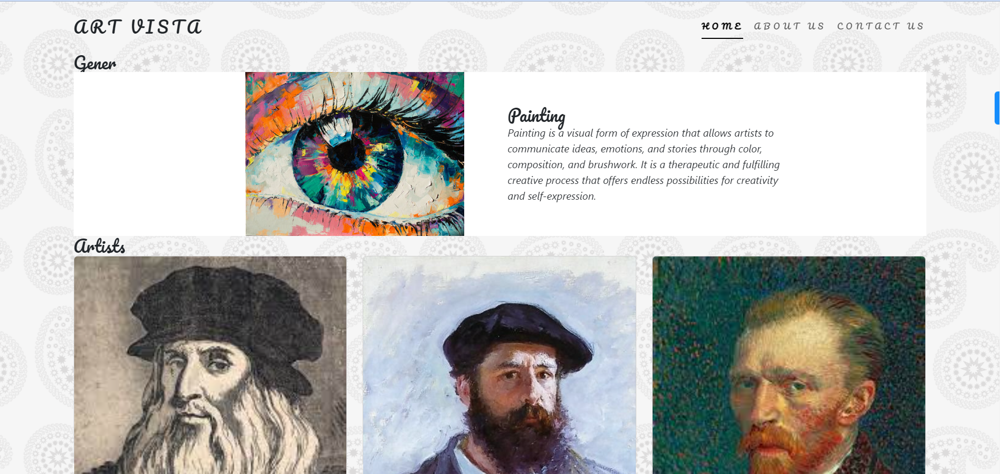

ArtVista - Virtual Art Gallery
**
**
ArtVista is a virtual art gallery website where you can explore various artists, genres, and their stunning works of art. Each artist and genre has its dedicated page, showcasing their unique creations. With engaging animations for images, visually pleasing fonts for texts, and captivating background patterns, ArtVista provides an immersive art experience to its users.

Table of Contents
Features
Getting Started
Installation
Usage
Contributing
License
Features
Explore different artists and their artworks
Discover various art genres and their notable pieces
Engaging animations to enhance the visual experience
Visually pleasing fonts for texts to create an artistic ambience
Captivating background patterns to complement the artworks
Easy to navigate and intuitive user interface
Getting Started
To get started with ArtVista, make sure you have the following prerequisites:

Web browser (Chrome, Firefox, Safari, etc.)
Internet connection
Installation
No installation is required to access ArtVista. Simply visit the website at example.com/artvista to start exploring the virtual art gallery.

Usage
Once you access ArtVista, you can start navigating through different pages to explore artists and genres. Here's a brief guide to using the website effectively:

On the homepage, you will find a menu with options to browse artists and genres.
Artist:
        You can hover on any image to experience engaging animations. Select an artist to visit their dedicated page.
        On the artist's page, you will discover their artworks in Art galleries.

        --> On each artist page we have details of the artist and their arts
        --> Each art would have the desciption which provides information about the art.
        --> You can click on "read more" in the description which gives a pop-up window   giving a detailed view of the art.
Genre:
        You can hover on any image to experience engaging animations. To explore different art genres, select a genre to view notable artworks belonging to that particular genre.

        --> On each genre page we have art ralated to that genre and the artist's name 
        --> When you click on that artist's name it will take you to the respective artist's page.
        --> Each art would have the desciption which provides information about the art.
        --> You can click on "read more" in the description which gives a pop-up window   giving a detailed view of the art.

About: 
        You can find more about ArtVista - the Virtual art gallery on this page.

Contact:
        On this page, you will find a form where you can reach us by submitting your details, leave queries etc.
        At the bottom of the page, you will find social media links in the form of icons which you can use to follow us and know more.

Throughout the website, you will find eye-catching animations, unique fonts, and captivating background patterns that enhance your art viewing experience.
Feel free to interact with the website, click on images for more information about specific artworks, and enjoy the virtual art gallery journey.

Contributing
We welcome and appreciate contributions from the community. If you have any suggestions, bug reports, or feature requests, please submit them through our GitHub repository. We kindly ask you to adhere to our code of conduct while participating in this project.

To contribute to ArtVista, follow these steps:

Fork the repository.
Create a new branch for your contribution.
Make your changes and enhancements.
Test thoroughly to ensure everything works as expected.
Submit a pull request detailing your changes.
We appreciate your effort in improving ArtVista and making it an even better virtual art gallery experience for everyone.

License
The ArtVista project is licensed under the MIT License.